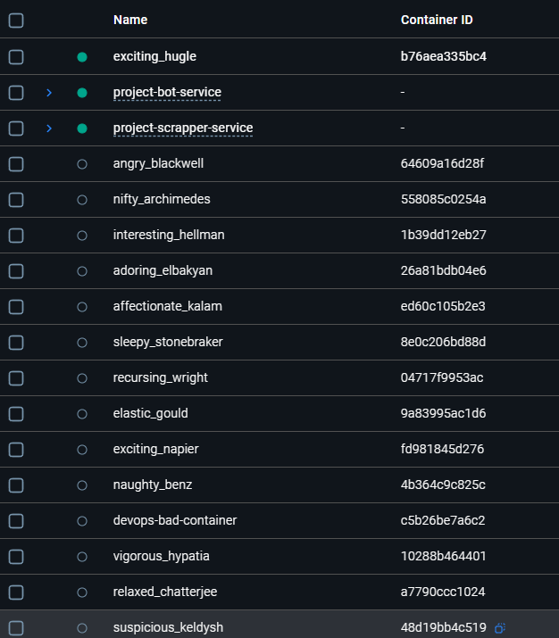

# 1 Лабораторная (Базовая)

Выполнил:

студент группы N3346,

Суханкулиев Мухаммет

## Контекст

Микро-веб-приложение, которое выводит сообщение с приветствием некогда известного блогера...

(его будем пытаться запускать докером)

## Часть 1

### Dockerfile

1. Не надо устанавливать большие и неконкретные образы. Потому что они большие... А `latest` - не всегда стабильны и, возможно, несовместимы со старыми версиями приложений.

**НАДО**: Если питон - можно использовать `-slim` и т.п., в зависимости от проекта. (и версию указывать)

2. `COPY . .` копирует абсолютно все в образ... не надо так. Плюс к этому - оно копирует все ДО установки зависимостей. Если скопировать весь проект, любое изменение в любом файле (даже в `README.md`) сделает кэш для слоя `pip install` невалидным, и все зависимости будут скачиваться заново. ПЛЮС еще: `WORKDIR \` - плохая практика, т.к. установка рабочей директории в корень загрязняет ФС.

**НАДО**: сначала задать `WORKDIR /app`, потом копировать только нужные файлы (`COPY requirements.txt .` + `COPY src/ .`).

3. Установка зависимостей без удаления кэша - мусор остается (это плохо).

**НАДО**: отключать или очищать кэш менеджеров пакетов во время сборки образа. (`pip install --no-cache-dir -r requirements.txt`, `rm -rf /var/lib/apt/lists/*` и т.п.)

4. Жестко прописан пусть до скрипта (`src/app.py`) - один из bad practice. Также контейнер запускается от `root` - тоже bad practice (связано с безопасностью).

**НАДО**: использовать `WORKDIR` и `USER`

5. Доп.: `.dockerignore` - один из good practice - чтобы докер не читал ВСЕ файлы из каталога и в перспективе работал быстрее (тот же `COPY . .` все равно не скопировал бы файлы, которые прописаны в `.dockerignore`).

Еще: про `requirements.bad.txt` - тут не прописаны версии - та же проблема что и в п.1.

Еще: про запуск сервера с `Flask` (хотя это больше по питону, но пусть будет): `app.run()` запускает встроенный веб-сервер Flask предназначенный только для разработки. Он однопоточный и не может эффективно обрабатывать несколько запросов одновременно, а также имеет уязвимости. (лучше `gunicorn` - это production-ready WSGI сервер, который является стандартом для развертывания Python-приложений)

Еще: про запуск самого контейнера `docker run -p 8000:8000 docker-bad` запускает контейнер со сгенеренным (смешным) названием. Лучше все-таки самому давать имя будущему контейнеру. (мб это можно было и в "Плохие практики при работе с контейнерами" запихнуть...)

Скриншот смешных названий контейнеров:



6. Отсутствие Multi-stage builds. В финальный образ могут попасть утилиты для сборки (например, компиляторы `gcc`, `build-essential`), которые не нужны для работы приложения.

**НАДО**: разделить на 2 этапа: `builder`, который все установит и соберет, второй этап, который будет содержать в себе только код приложения и уже установленные пакеты из виртуального окружения, созданного на первом этапе.

7. Еще можно отметить (просто у меня не написано) - много `RUN` слоев. Например:
```
RUN apt-get update
RUN apt-get install -y curl
RUN apt-get install -y git
```
когда можно обойтись
```
RUN apt-get update \
 && apt-get install -y curl git \
 && rm -rf /var/lib/apt/lists/*
```

### Плохие практики при работе с контейнерами

1. Разработчик может зайти в контейнер (`docker exec -it my-container bash`), установить пакет (`apt-get install vim`), поменять конфиг. Эти изменения существуют только в этом конкретном контейнере. Если контейнер будет пересоздан, все "ручные" правки пропадут.

**НАДО:** Все изменения вносить в `Dockerfile`, после чего пересобирать образ.

2. Использование bind mounts для кода приложения в production. В `docker-compose.yml` для production-окружения прописывается `volumes: - ./app:/app`. Это монтирует исходный код с хост-машины прямо в контейнер.

**Последствия:** Безопасность (код можно изменить на хосте), производительность, контейнер перестает быть самодостаточным.

**НАДО:** Исходный код должен быть запечен в образ на этапе сборки (`COPY` в `Dockerfile`).

## Часть 2

### Docker Compose

1.

### Сетевая изоляция контейнеров в Docker Compose
