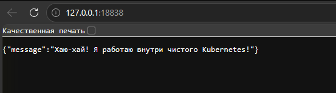
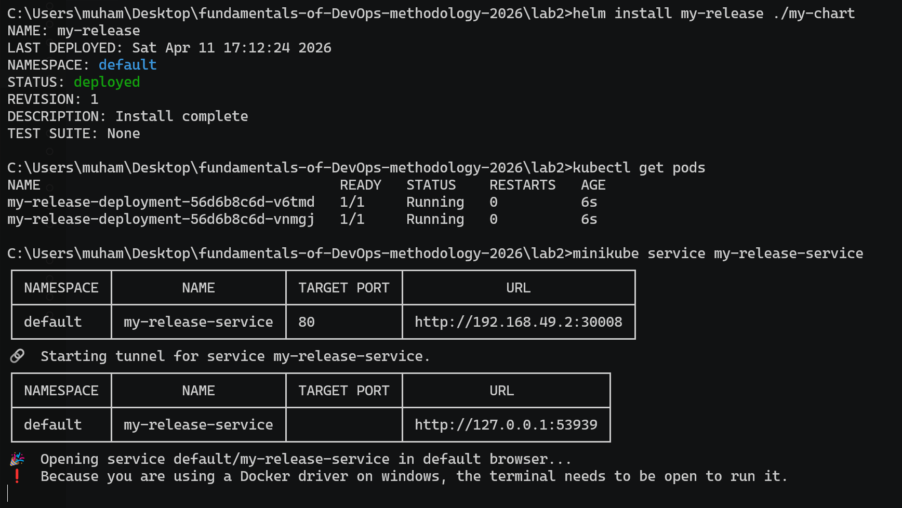
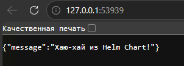
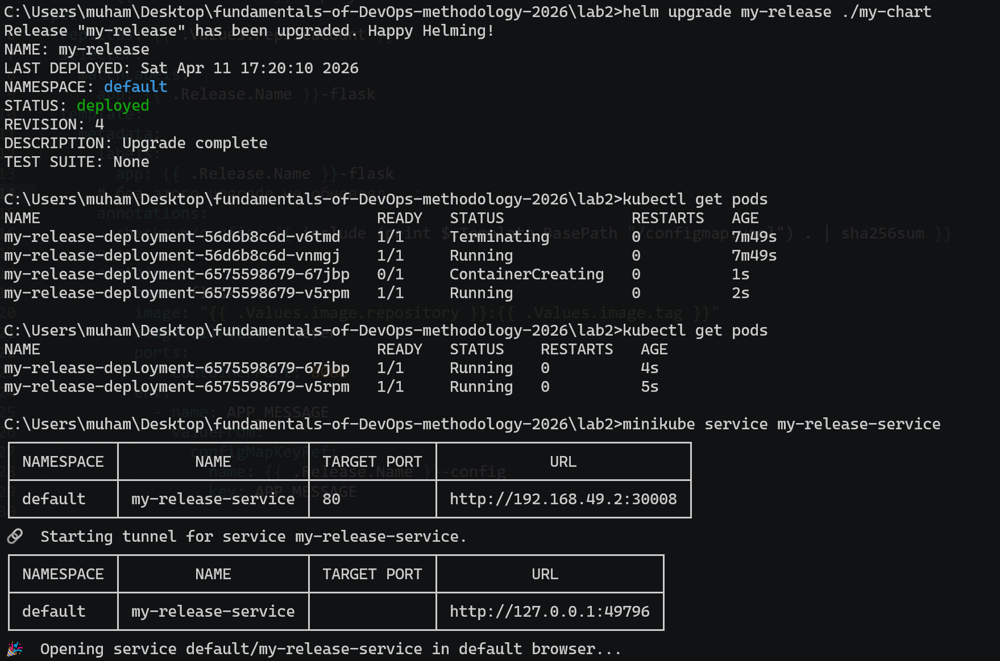
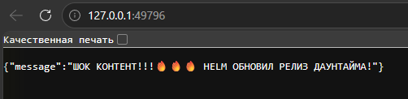

# 2 Лабораторная (Базовая)

Выполнил:

студент группы N3346,

Суханкулиев Мухаммет

---

## Контекст

Развертывание микро-веб-приложения на Flask в локальном кластере Kubernetes (Minikube). Приложение чуть переделал: теперь текст берется из переменной окружения `APP_MESSAGE`, чтобы можно было показать ConfigMap и Helm.

---

## Часть 1: Классические манифесты Kubernetes

Для запуска сервиса использовались 3 абстракции (как в книжке про жирафа Пышку, которую пришлось прочитать🙄):

1. **ConfigMap** (`configmap.yaml`) - хранит конфигурацию (в моем случае текст) отдельно от кода приложения.

2. **Deployment** (`deployment.yaml`) - контроллер, который следит, чтобы всегда работало заданное количество копий (реплик) нашего приложения.

3. **Service** (`service.yaml`) - чтобы вообще можно было достучаться до приложения снаружи (иначе это всё живет внутри кластера и бесполезно).

**Процесс запуска:**

Сборка образа прямо внутри кластера (иначе kubernetes начинает пытаться скачать образ из интернета, а он у меня локальный):

```bash
minikube image build -t my-flask-app:1.0 .
```

Деплой:

```bash
kubectl apply -f k8s/
```

*Скриншот:*


*Скриншот:*


---

## Часть 2: Helm Chart

Написал свой Helm-чарт (по сути просто обернул обычные манифесты в шаблоны). Все жестко заданные значения вынесены в `values.yaml`.

**Процесс установки:**

```bash
helm install my-release ./my-chart
```
*Скриншот установки релиза:*


*Скриншот приложения до апгрейда:*


---

### Обновление (Upgrade) релиза

Для изменения сервиса достаточно было просто поменять значение `message` в файле `values.yaml` и выполнить команду апгрейда:

```bash
helm upgrade my-release ./my-chart
```

**Важный нюанс при апгрейде ConfigMap:**

По умолчанию Kubernetes не перезапускает Pod'ы при изменении связанного с ними ConfigMap (переменные окружения считываются только при старте контейнера). Чтобы решить эту проблему автоматизированно, в Helm-чарт (`templates/deployment.yaml`) пришлось добавить такую *Best Practice* штуку:

***Проблема:*** при изменении ConfigMap поды сами не перезапускаются (сначала долго не понимал, почему ничего не меняется).

***Решение:*** добавляем аннотацию с хэшем:

```yaml
annotations:
  checksum/config: {{ include (print $.Template.BasePath "/configmap.yaml") . | sha256sum }}
```

Благодаря этому, при любом изменении `message` в `values.yaml`, меняется хэш в шаблоне Deployment, что триггерит автоматический Rolling Update подов без простоя (downtime).

*Скриншот апгрейда:*


*Скриншот приложения после апгрейда:*


---

### Почему Helm удобнее, чем классические манифесты:

1. **Параметризация и переиспользование (DRY).**

   В сыром Кубере, если нужно развернуть один и тот же сервис на Dev и Prod окружениях, приходится копипастить YAML-файлы и вручную менять порты, пароли и количество реплик. В Helm у нас есть один шаблонный чарт и два разных файла `values-dev.yaml` и `values-prod.yaml`. Мы просто подставляем нужные значения.

2. **Удобный процесс обновления и отката.**

   `helm upgrade` аккуратно применяет изменения. Если после деплоя новой версии приложение упало (ошибка в коде или конфиге), можно одной командой `helm rollback my-release 1` откатить всё состояние кластера к предыдущей рабочей ревизии. Сырой `kubectl apply` не дает такого удобного управления версиями целого "пакета" приложения.

3. **Пакетный менеджер.**

   Helm - это что-то типа пакетного менеджера (`apt`/`pip`, только для Kubernetes). Если нужно поднять сложную базу данных со всеми её `StatefulSet`, `PersistentVolume`, `Secrets`, не нужно писать тысячи строк YAML. Просто можно сделать `helm install postgresql bitnami/postgresql` и получить готовый сервис из открытого репозитория.

---

### Про `.env`:

В отличие от Docker Compose, где `.env` файлы используются напрямую для передачи переменных, Kubernetes использует собственный механизм управления конфигурацией:

*   **ConfigMap** - для обычных текстовых конфигураций и переменных (в моей лабе это текст приветствия).

*   **Secret** - для чувствительных данных (пароли, ключи).

*   В **Helm** роль главного конфигурационного файла выполняет `values.yaml`.

В итоге конфигурация живет уже не в файлах рядом с кодом, а внутри самого Kubernetes, что логичнее (и безопаснее, если речь про секреты).
