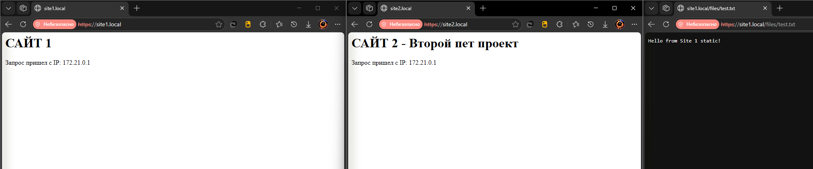
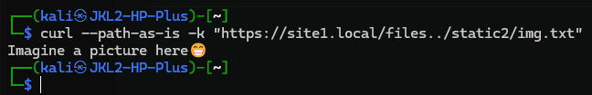
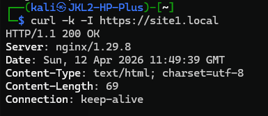
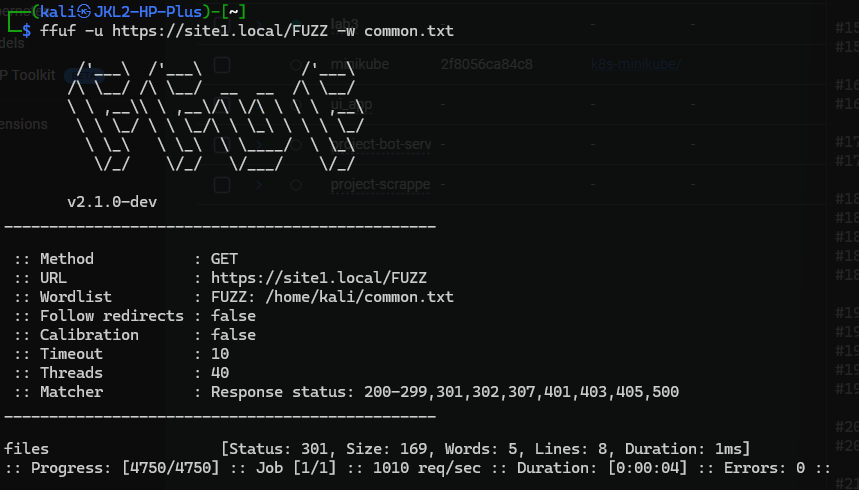

# 3 Лабораторная (Базовая)

Выполнил:

студент группы N3346,

Суханкулиев Мухаммет

---

## Часть 1: Настройка Nginx

Развернул всю инфраструктуру через **Docker Compose** (на винде).

**Архитектура:**

*   Два контейнера с Flask-приложениями (`app1`, `app2`) (запуск по аналогии с прошлыми лабами).

*   Контейнер `nginx`, который смотрит наружу портами 80 и 443. В него прокинуты сертификаты, конфиг и папки со статикой.

*   Изменен файл `hosts` в Windows для эмуляции DNS: `site1.local` и `site2.local` смотрят на `127.0.0.1`.

### `nginx.conf`:

1. **HTTP -> HTTPS редирект.** 

   Слушаем порт 80, и если запрос приходит туда, отдаем код `301 Moved Permanently` с подстановкой HTTPS.

2. **Виртуальные хосты.** 

   Два блока `server { listen 443 ssl; ... }`. Nginx понимает, к какому сайту перенаправлять запрос, сверяя заголовок с `server_name site1.local;` или `site2.local;`.

3. **Работа с SSL.** 

   Сертификаты (self-signed) сгенерировал через докер-контейнер `alpine/openssl`. Браузер ругается, но шифрование работает.

```bash
docker run --rm -v "%cd%\nginx\ssl:/ssl" alpine/openssl req -x509 -nodes -days 365 -newkey rsa:2048 -keyout /ssl/nginx.key -out /ssl/nginx.crt -subj "/C=RU/ST=Moscow/L=Moscow/O=ITMO/OU=DevOps/CN=localhost"
```

4. **Проксирование и заголовки.** 

   Передаем настоящие IP-адреса клиентов во Flask через `X-Real-IP` и `X-Forwarded-For`.

5. **Директива `alias`.** 

   Если зайти на `site1.local/files/`, Nginx подменит путь на физическую папку `/var/www/static1/` внутри контейнера.

*Скриншот проверки работы сайтов:*



*(Подключение не защищено 🙄 (все ок)).*

---

## Часть 2: Аудит безопасности

**ЭТИЧЕСКИЙ ДИСКЛЕЙМЕР:** 

Поскольку сканирование чужих сайтов без разрешения - это незаконно, я решил ломать **свой собственный сервер**. 

Для чистоты эксперимента я специально "испортил" свой `nginx.conf`, провел атаки, зафиксировал результаты, а затем **исправил все уязвимости** в итоговом конфиге, который лежит в репозитории.

Проверил конфигурацию на следующие уязвимости:

### 1. Nginx Alias Path Traversal

Самая частая ошибка при настройке `alias`. Я временно удалил замыкающий слэш в директиве `location` первого сайта:

```nginx
location /files {
    alias /var/www/static1/;
}
```

**Как проверял:** 

Попытался прочитать системный файл `/etc/passwd` через `https://site1.local/files../../../../../etc/passwd`. Но свежий Nginx отбил атаку (400 Bad Request), так как он блокирует выход выше корневого каталога `/` в URL.

Но я знаю, что статика второго проекта лежит рядом (`/var/www/static2/`). Для выхода к соседу нужен всего один `../`, что Nginx не блокирует😱


```bash
curl --path-as-is -k "https://site1.local/files../static2/img.txt"
```

**Результат:** Nginx склеил пути в `/var/www/static1/../static2/img.txt`. Я смог прочитать файлы соседнего изолированного проекта.

**Как исправил:** вернул слэш на место: `location /files/ { alias ... }`.

*Скриншот:*



### 2. Раскрытие информации о сервере

По умолчанию Nginx отдает свою версию в заголовках.

**Как проверял:**

```bash
curl -k -I https://site1.local
```

**Результат:** Сервер вернул `Server: nginx/1.29.8`. Для реального хакера это подарок - можно легко нагуглить CVE именно под эту сборку.

**Как исправил:** Добавил директиву `server_tokens off;` в секцию `http` в итоговом конфиге.

*Скриншот:*



### 3. Fuzzing скрытых директорий

Проверил, можно ли найти скрытые пути банальным перебором.

**Как проверял:** 

Запустил `ffuf` из-под Kali Linux с дефолтным словарем `common.txt`:

```bash
ffuf -u https://site1.local/FUZZ -w common.txt
```

**Результат:** Скрипт предсказуемо нашел путь `files` (код 301).

*Скриншот:*



### 4. Отсутствие Rate Limiting

В ходе тестов заметил, что сервер никак не ограничивает частоту запросов. `ffuf` мог отправлять сотни запросов в секунду. 

**Чем грозит:** Это делает сервер уязвимым к легкому DDoS и упрощает брутфорс паролей, если бы на сайте была админка.

**Как исправить в будущем:** Использовать директиву `limit_req_zone $binary_remote_addr zone=one:10m rate=10r/s;`.
