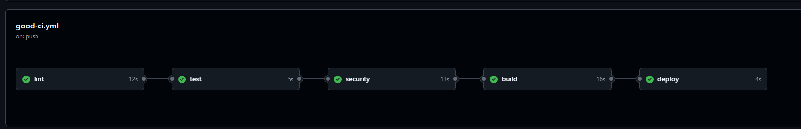
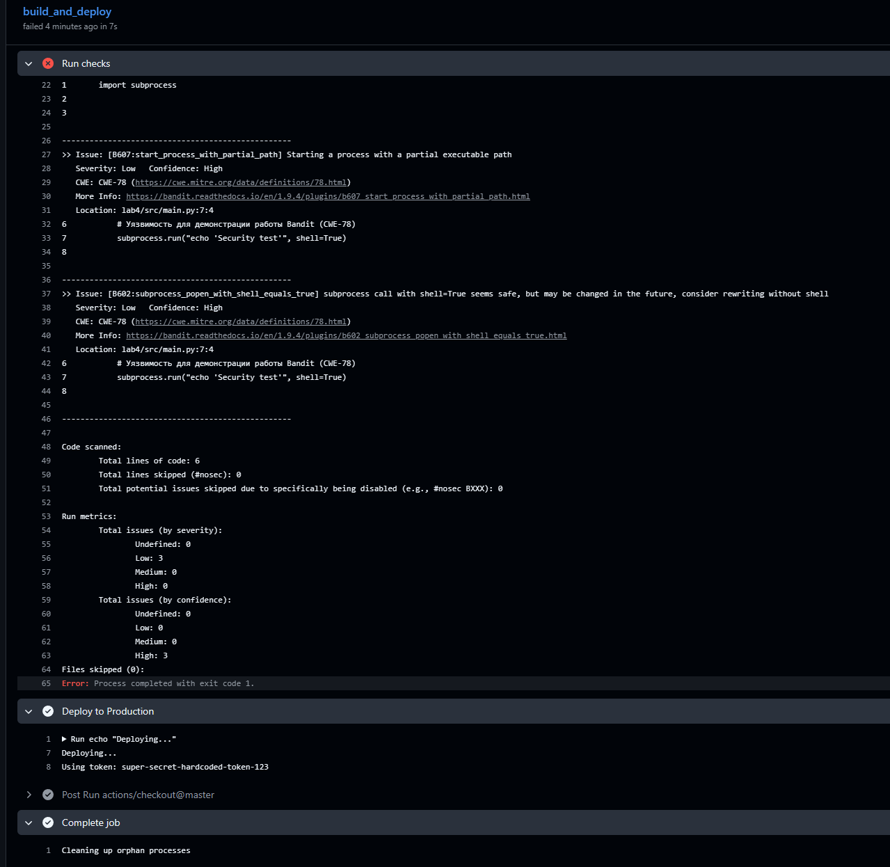
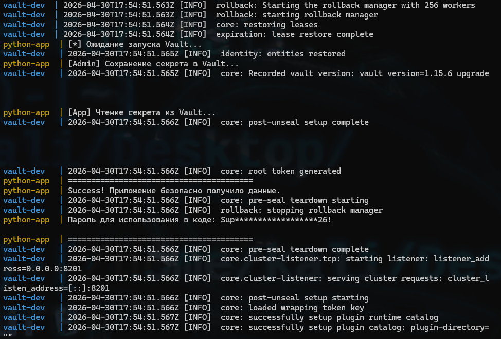
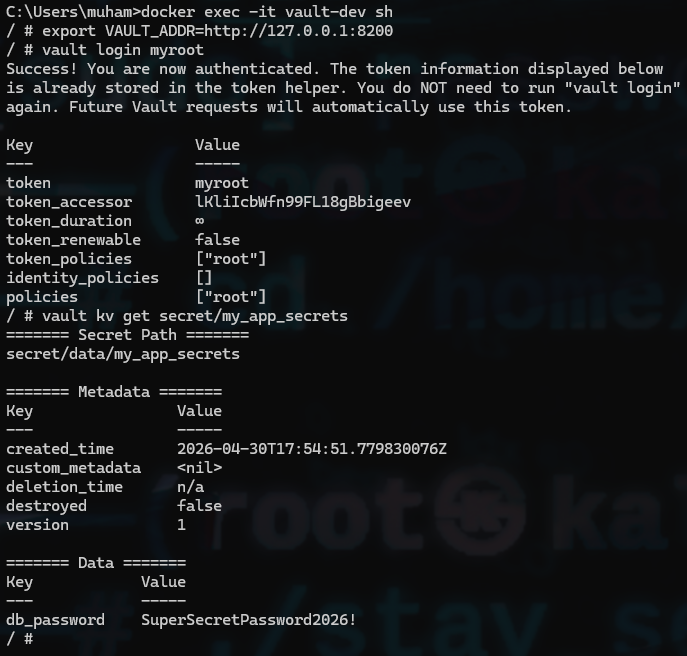

# 4 Лабораторная (Базовая)

Выполнил:

студент группы N3346,

Суханкулиев Мухаммет

---

## Часть 1: CI/CD Пайплайны (GitHub Actions)

Написал два файла для GitHub Actions: "плохой" (`bad-ci.yml`) и "хороший" (`good-ci.yml`), чтобы наглядно показать, как несколько простых правил могут превратить хаотичный скрипт в надежный CI/CD конвейер.

### "Плохой" пайплайн

Собрал все типичные ошибки:

1. **Деплой любой ценой (`if: always()`)**

   *В чем проблема:* Я сделал так, чтобы линтер падал (`exit 1`). Но из-за `if: always()` строчки этап деплоя всё равно запустился. Получается, на прод улетел бы заведомо сломанный код. (не надо так)

2. **Хардкод секретов**

   *В чем проблема:* `SECRET_TOKEN` не надо распространять!..

3. **Плавающие теги (`ubuntu-latest`, `checkout@main`)**

   *В чем проблема:* Сегодня работает, а завтра GitHub обновит `latest` версию или что-то сломается в `main` ветке экшена, и весь пайплайн встанет. Зис из колд "недетерминированная сборка".

4. **Гонка этапов (Нет `needs`)**

   *В чем проблема:* Все этапы (джобы) запускаются одновременно. Деплой может начаться раньше, чем закончатся тесты.

5. **Прочее:** Нет кэширования `pip`, слишком широкие права у токена, триггер на любое изменение (даже в `README`).

### "Хороший" пайплайн

Здесь я всё исправил:

1. **Выстроил строгую цЕпочку:** `lint` -> `test` -> `security` -> `build` -> `deploy`. Если падает `lint`, то `deploy` не запустится.

2. **Зафиксировал версии:** Использую `ubuntu-22.04` и `@v4` у экшенов.

3. **Безопасно работаю с секретами:** Токен хранится в GitHub Secrets и передается через `env`, где его автоматически маскируют звездочками `***`.

4. **Оптимизировал скорость:** Включил кэширование `pip`. Теперь зависимости не качаются каждый раз заново.

5. **Сделал "умный" запуск:** Пайплайн запускается только при изменениях в коде (`paths-ignore`) и отменяет старые запуски, если я делаю несколько коммитов подряд (`concurrency`).

*Скриншоты выполнения пайплайнов в GitHub:*







---

## Часть 2: Работа с секретами (HashiCorp Vault)

Для демонстрации "взрослого" подхода к управлению секретами я поднял локальный кластер HashiCorp Vault через Docker Compose. Рядом с ним запускается Python-сервис, который ходит в Vault, забирает оттуда пароль и выводит его в консоль в замаскированном виде...

### Архитектурные нюансы демонстрации

1. **Dev Mode:** Для упрощения локального запуска в `docker-compose.yml` включен режим разработчика (`VAULT_DEV_ROOT_TOKEN_ID`). В реальном production рут-токены никогда не прокидываются через env-переменные.

2. **Разделение ролей:** Архитектурно правильно, чтобы приложение имело права *только на чтение* (Read-policy), а секреты закладывались администратором (Admin-policy). В скрипте `app.py` обе эти роли объединены исключительно для того, чтобы весь стенд запускался одной командой `docker-compose up`, но в коде они строго разделены...  комментариями😅.

3. **Отказоустойчивость:** Вместо антипаттерна `time.sleep()` реализован "продакшен-стайл"" retry loop, который опрашивает API Vault до момента его готовности.

4. **Retry Loop vs Depends_on:** Директива `depends_on` в Docker Compose гарантирует только факт старта контейнера Vault, но не готовность его API принимать запросы. Поэтому на стороне Python-приложения реализован умный цикл повторных попыток (`wait_for_vault`).

*Скриншот успешной работы сервиса (в консоли реализован App-level masking для предотвращения утечки секрета в stdout) (пароль замаскирован звездочками):*



### Проверка сохранения секрета через Vault CLI

Чтобы убедиться, что секрет реально лежит в хранилище, а не просто в скрипте, я зашел в контейнер и прочитал его напрямую через клиент Vault. *(Сначала столкнулся с ошибкой `http: server gave HTTP response to HTTPS client`, но пофиксил ее, явно указав `export VAULT_ADDR=http://...`)*.

```bash
docker exec -it vault-dev sh
export VAULT_ADDR=http://127.0.0.1:8200
vault login myroot
vault kv get secret/my_app_secrets
```

*Скриншот ручной проверки:*



### GitHub Secrets vs HashiCorp Vault

Для маленьких проектов GitHub Secrets - это нормально. Но в больших компаниях это считается **менее масштабируемым подходом** по сравнению с Vault (или AWS Secrets Manager...).

**Главные фишки Vault, которых нет в GitHub Secrets:**

1. **Dynamic Secrets (Динамические секреты).** Vault может генерировать пароли "на лету" со сроком жизни (TTL).

2. **Single Source of Truth (Единая точка правды).** Если у 50 микросервисов общий ключ API, его нужно поменять в одном месте, а не в 50 репозиториях на GitHub.

3. **Строгий аудит.** Vault логирует каждый запрос к секрету: кто, когда и зачем его прочитал.
