# 5 Лабораторная (Базовая. звездочка не удалась)

Выполнил:

студент группы N3346,

Суханкулиев Мухаммет

---

## Контекст

В качестве подопытного использовано микро-веб-приложение на Flask из прошлых лабораторных работ, доработанное для отдачи метрик в формате Prometheus.

---

### 1. Подготовка приложения

Чтобы Prometheus мог хоть что-то собирать, приложение должно отдавать метрики в понятном ему формате. Я добавил библиотеку `prometheus-flask-exporter`.

Она автоматически оборачивает все маршруты и создает эндпоинт `/metrics`, где публикуются данные о количестве запросов, HTTP-кодах (200, 404, 500) и задержках (latency).

Ещё я специально добавил маршрут `/error` с делением на ноль, чтобы на графиках было наглядно видно, как летят 500-е ошибки.

### 2. Установка стека мониторинга

Использовал Helm. Поставил официальный чарт `kube-prometheus-stack`, в котором есть вообще всё "из коробки" (включая метрики самого k8s-кластера).

```bash
helm repo add prometheus-community https://prometheus-community.github.io/helm-charts
helm repo update
```

*Добавление репозитория:*

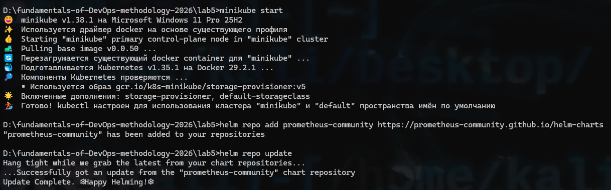

```bash
helm install monitoring prometheus-community/kube-prometheus-stack
```

*Установка стека:*

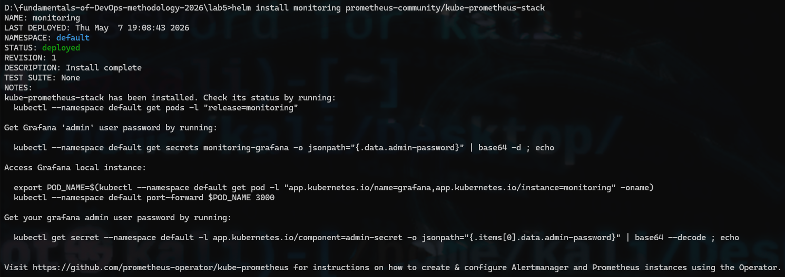

### 3. ServiceMonitor

Чтобы Prometheus узнал о моем Flask-приложении, я не стал лезть руками в конфиги Прометеуса (это антипаттерн). Вместо этого написал манифест `ServiceMonitor`. 

Это Custom Resource Definition (CRD), который динамически сообщает оператору Prometheus: *"Иди к сервису с label `app: flask-monitor` и собирай метрики, чел"*.

### 4. Сборка и Деплой

Собираем образ внутри миникуба (чтобы k8s не пытался скачать его из интернета):

```bash
minikube image build -t my-flask-app:3.0 .
```

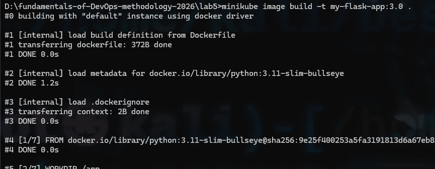

Деплоим манифесты:

```bash
kubectl apply -f k8s/app.yaml
```

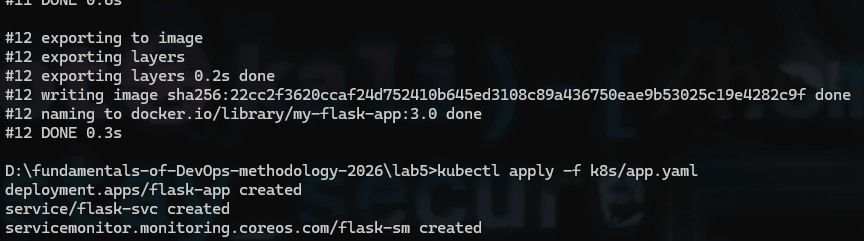

Проверяем поды и открываем туннель к приложению:

```bash
kubectl get pods
minikube service flask-svc
```

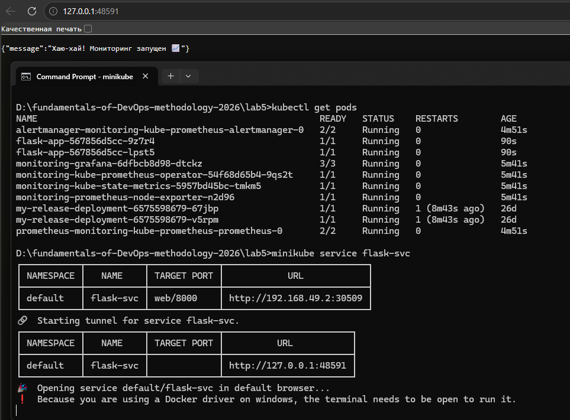

Прокидываем порт к Grafana на `localhost:8080`:

```bash
kubectl port-forward svc/monitoring-grafana 8080:80
```

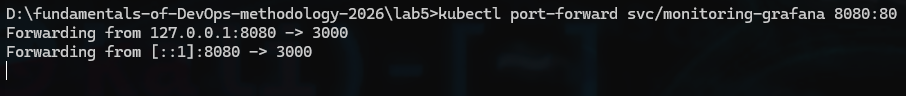

---

## Вход в Графиню

Панель Grafana доступна по адресу `http://localhost:8080`.

* Логин по умолчанию: `admin`
* Пароль генерируется автоматически при установке Helm-чарта.

*(Примечание: пароль можно было задать при установке через `--set grafana.adminPassword=...`, но уже было поздно... (об этом и на рисунке "Добавление репозитория" было сказано...)).*

Чтобы узнать пароль, я посмотрел секреты кластера и вытащил нужный в формате json:

```bash
kubectl get secrets -A
kubectl get secret monitoring-grafana -o jsonpath="{.data.admin-password}"
```

*Поиск секрета:*

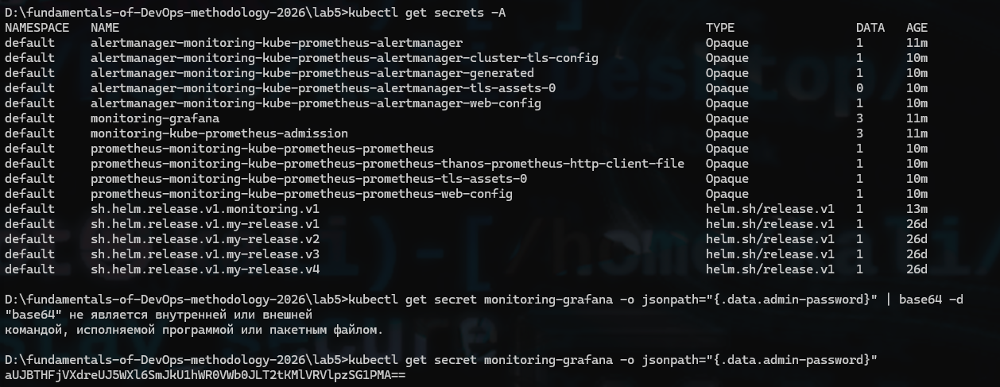

Так как стандартная консоль Windows не поддерживает линуксовую команду `base64 -d`, я скопировал закодированное значение и расшифровал его с помощью **CyberChef** (кибер-повар😁):

*Декодирование Base64 в CyberChef:*

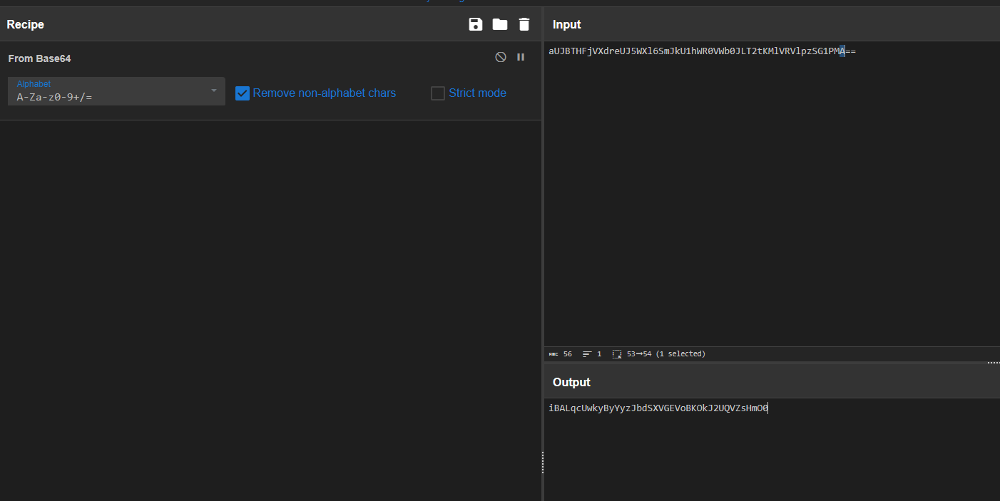

*Окно входа в Графаню:*

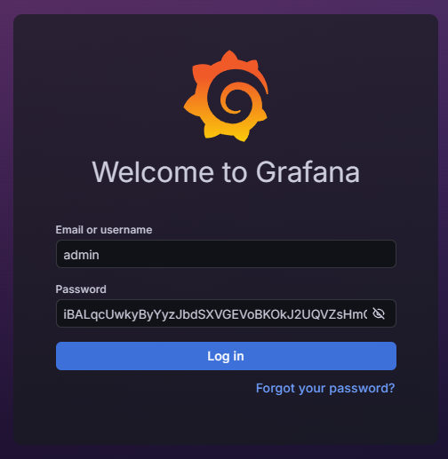

---

## Результаты (Графики Графани)

Для проверки мониторинга я сгенерировал нагрузку на приложение:

```cmd
for /L %i in (1,1,100) do curl -s "http://127.0.0.1:48591/" >nul & curl -s "http://127.0.0.1:48591/error" >nul
```

### График 1: Состояние системы (Инфраструктурный мониторинг)

`kube-prometheus-stack` автоматически создает дашборды для мониторинга железа и компонентов k8s. Ниже представлен стандартный график `Prometheus / Overview`, отражающий сбор метрик с таргетов.

*Скриншот системных метрик:*

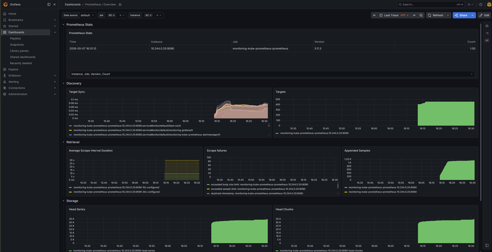

### График 2: Состояние приложения (Продуктовый мониторинг)

Я создал кастомный Dashboard, чтобы отслеживать метрики конкретно моего приложения. 

PromQL запрос: `flask_http_request_total`. На графике видно распределение входящих запросов. 

**Забавная деталь:** На графике видно 4 линии. Почему? Потому что у нас работает **2 пода (реплики)**, и каждый из них ловит по **2 типа статусов** (200 OK и 500 Error). Kubernetes балансирует нагрузку между подами, поэтому графики растут плюс-минус одинаково. Красная и синяя линии - это 500-е ошибки, а зеленая и желтая - успешные запросы.

*Настройка кастомного запроса:*

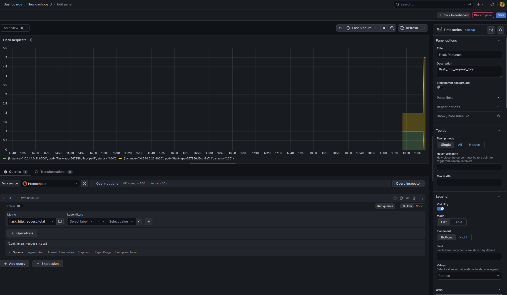

*Скриншот продуктовых метрик (Flask App):*

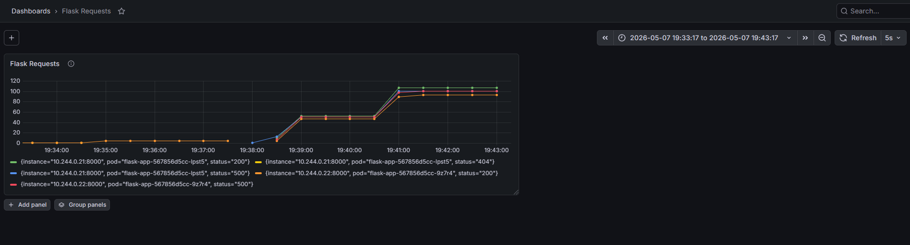

---

# Ниже - история тотального провала 😭

## Часть со звездочкой: Alertmanager + Telegram (IaC)

### 1. Правило алерта

Я написал Kubernetes-манифест `PrometheusRule`, который описывает логику срабатывания: если скорость 500-х ошибок превышает определенный порог, Prometheus должен зажечь алерт `HighErrorRate`.

Применил правило в кластер:

```bash
kubectl apply -f k8s/alert-rule.yaml
```

### 2. Маршрутизация в Telegram

Чтобы Alertmanager знал, куда слать уведомления, я создал бота в `@BotFather` и переопределил конфиг Alertmanager'а через `alertmanager-values.yaml`, указав там `bot_token` и `chat_id`. 

```yaml
alertmanager:
  alertmanagerSpec:
    useExistingSecret: false
    
  config:
    global:
      resolve_timeout: 5m
    route:
      group_by: ['alertname']
      group_wait: 10s
      group_interval: 10s
      repeat_interval: 1h
      receiver: 'telegram-bot'
    receivers:
    - name: 'telegram-bot'
      telegram_configs:
      - bot_token: "999999999999:AAAAAAAAAA-BBBBBBBBBBBBBB-CCCCCCCCCCC"
        chat_id: 999999999999
        message: |-
          {{ range .Alerts }}
          <b>{{ .Annotations.summary }}</b>
          🚨 Ситуация: {{ .Annotations.description }}
          Состояние: {{ .Status }}
          {{ end }}
        parse_mode: HTML
```

Обновил Helm-релиз стека мониторинга:

```bash
helm upgrade monitoring prometheus-community/kube-prometheus-stack -f alertmanager-values.yaml
```

Для проверки и тестирования системы алертинга:

```bash
kubectl port-forward svc/monitoring-kube-prometheus-prometheus 9090:9090
```

```bash
kubectl port-forward svc/monitoring-kube-prometheus-alertmanager 9093:9093
```

### 3. Демонстрация работы и Траблшутинг

Я запустил скрипт, генерирующий 500-е ошибки.

```cmd
for /L %i in (1,1,10000) do curl -s "http://127.0.0.1:48591/error" >nul
```

*   **Prometheus** успешно обнаружил проблему и перевел алерт в состояние `FIRING`.
*   **Alertmanager** также успешно получил алерт от Prometheus. Это видно в его веб-интерфейсе.

*Скриншот сработавшего алерта в Prometheus:*

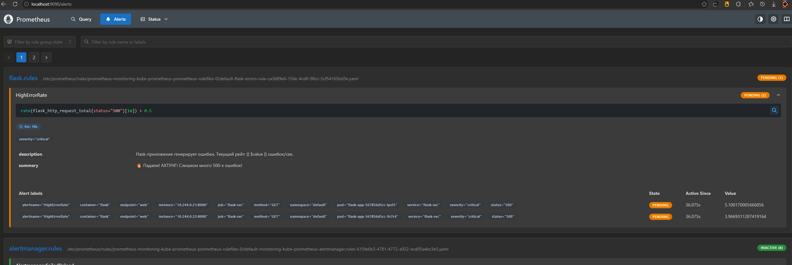

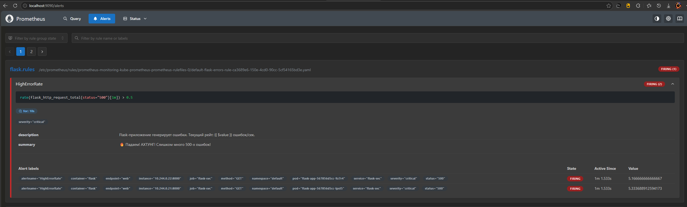

*Скриншот полученного алерта в Alertmanager:*

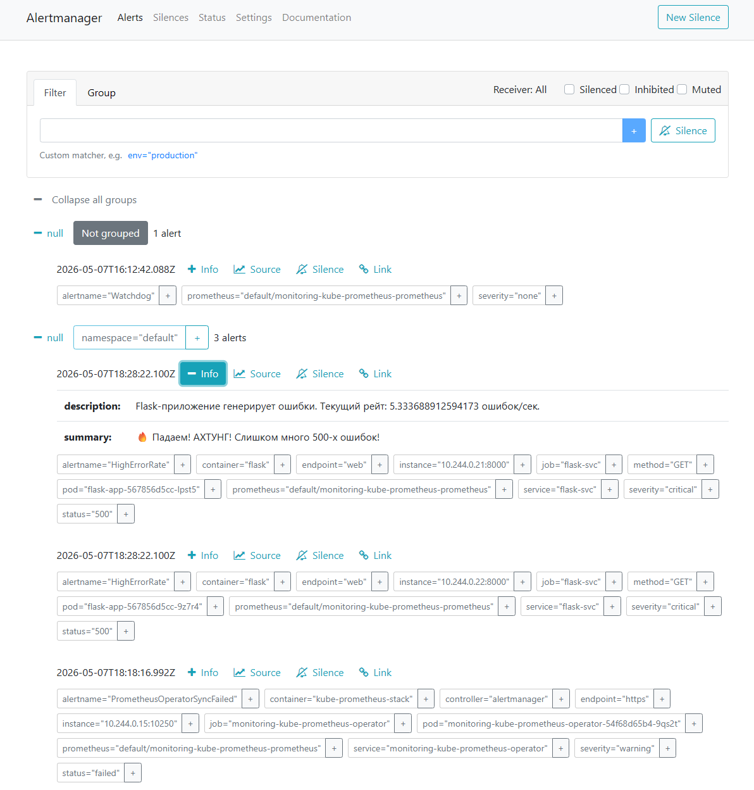

**Проблема:** Сообщение в Telegram так и не пришло. Начался процесс траблшутинга🙄🙄🙄:

1.  **Проверка API Telegram:** Я отправил тестовое сообщение боту напрямую с моего компьютера через `curl`. **Сообщение пришло.** Вывод: с ботом и токеном всё в порядке.
2.  **Проверка логов Alertmanager:** В логах не было никаких ошибок. Это означало, что Alertmanager даже не может установить TCP-соединение с `api.telegram.org`.
3.  **Гипотеза:** Проблема в сетевой доступности. Мой компьютер работает через VPN, а кластер Minikube внутри Docker Desktop - нет. Он пытается достучаться до заблокированного в IP-адреса Telegram напрямую.

**Почему дальше реализовать невозможно (в текущем окружении):**

Для успешной доставки уведомления необходимо, чтобы под Alertmanager'a имел сетевой доступ к серверам Telegram. В рамках текущей конфигурации (Minikube на Windows без проксирования трафика кластера через VPN) это невозможно по понятным причинам 🥲.

**Возможное решение в реальной жизни (но выходит за рамки лабы):**

*   Настроить в кластере Kubernetes прокси-сервер, который будет ходить в интернет через VPN.


### Итог...

Реализован полноценный пайплайн мониторинга с оповещениями: `Приложение -> Prometheus (сбор) -> Alertmanager (роутинг)`. Цепочка успешно отработала вплоть до этапа отправки. Доставка в Telegram не удалась по объективной внешней причине... Но я не сдался!

---

## Часть со звездочкой (план Б): Alertmanager + Gmail (IaC)

### 1. Подготовка

1. Включил двухфакторную аутентификацию (2FA) в настройках аккаунта.
2. Перешел в раздел App Passwords.
3. Сгенерировал специальный 16-значный "Пароль приложения" для Alertmanager.

*Скриншот настройки пароля в Google:*

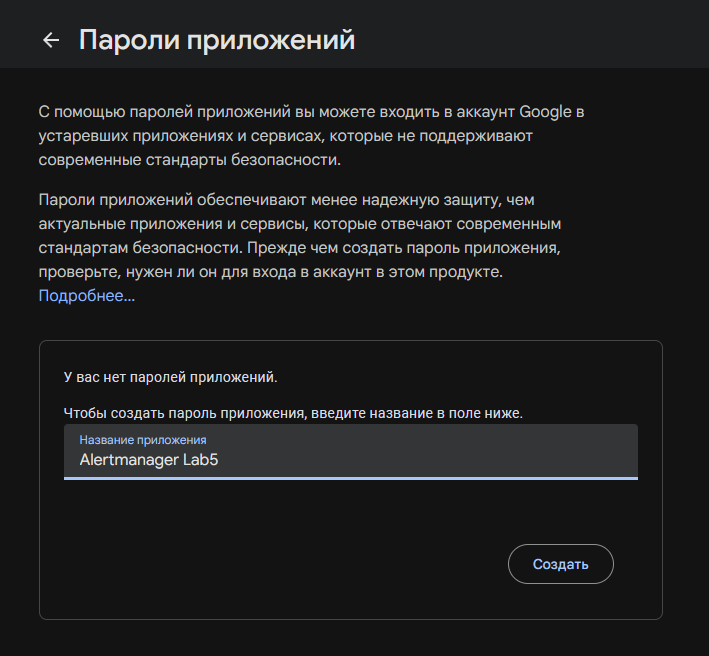

Обновил файл `alertmanager-values.yaml`:

```yaml
alertmanager:
  alertmanagerSpec:
    useExistingSecret: false
    storage: {}
  config:
    global:
      smtp_smarthost: 'smtp.gmail.com:587'
      smtp_from: 'muhammet.jkl2.suhanguylev@gmail.com'
      smtp_auth_username: 'muhammet.jkl2.suhanguylev@gmail.com'
      smtp_auth_password: 'gigachad2003nenastoyachijpass'
      smtp_require_tls: true
    route:
      group_by: ['alertname']
      group_wait: 5s
      group_interval: 5s
      repeat_interval: 1h
      receiver: 'gmail-notifications'
      routes:
        - matchers:
            - alertname = Watchdog
          receiver: 'null'
    receivers:
    - name: 'gmail-notifications'
      email_configs:
      - to: 'muhammet.jkl2.suhanguylev@gmail.com'
        send_resolved: true
    - name: 'null'
```

Чтобы применить изменения в кластере, я выполнил команду апгрейда нашего Helm-релиза:

```bash
helm upgrade monitoring prometheus-community/kube-prometheus-stack -f k8s/alertmanager-values.yaml
```

*Скриншот процесса апгрейда и запуска туннеля:*

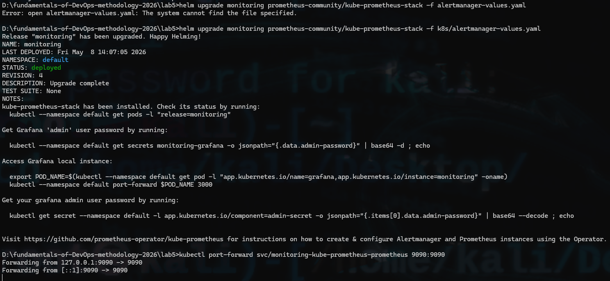

### 2. Подтверждение корректности настройки

Я проверил, что кластер Kubernetes успешно принял и применил конфигурацию:

*   В интерфейсе Alertmanager на странице **Status** подтверждено, что ресивер `gmail-notifications` активен и содержит верные параметры SMTP.
*   В интерфейсе **Alerts** видно, что алерт `HighErrorRate` перешел в состояние `FIRING` и успешно назначен на почтовый канал.

*Скриншот статуса конфигурации (IaC применился):*

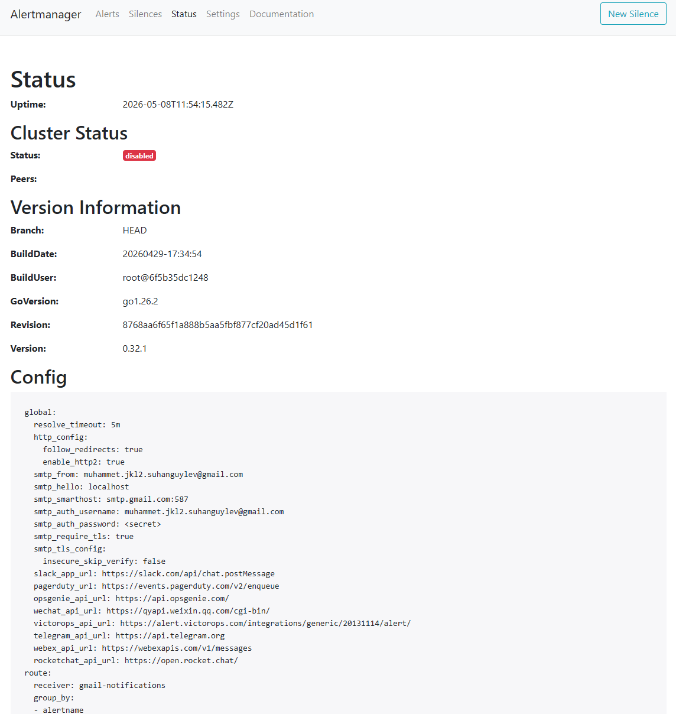

### 3. Траблшутинг

Несмотря на верную конфигурацию, письмо в почтовый ящик не поступило...

1.  **Сетевой уровень:** Выполнил `telnet smtp.gmail.com 587` изнутри пода Alertmanager. Соединение установилось (`Connected`), что доказывает наличие доступа в интернет из кластера.
2.  **Уровень приложения:** Я проанализировал логи пода Alertmanager:
    `kubectl logs alertmanager-monitoring-... -c alertmanager`
    Была обнаружена критическая ошибка:
    `err="gmail-notifications/email[0]: notify retry canceled: context deadline exceeded"`

**Аргументация невозможности финальной доставки:**

Сетевой сеанс с SMTP-сервером Google прерывается по таймауту. В условиях локального запуска (Minikube внутри Docker Desktop на Windows) это вызвано внешними факторами: либо спецификой маршрутизации пакетов через виртуальный сетевой мост Docker, либо фильтрацией SMTP-трафика на стороне интернет-провайдера, что делает стабильную TLS-аутентификацию с серверами Google невозможной...

### Итог по звездочке №2

Логика алертинга описана кодом, правила мониторинга работают, инфраструктура оповещений развернута и проверена. Финальный этап доставки неудачен =(
